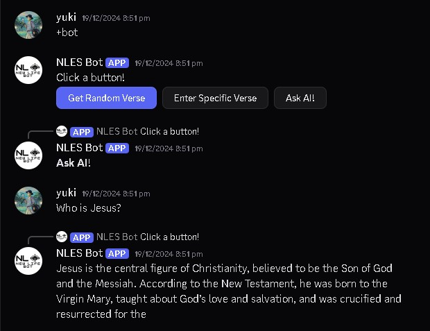
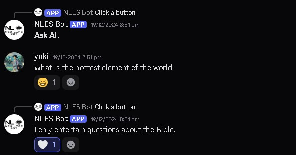
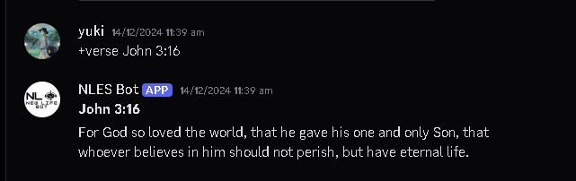
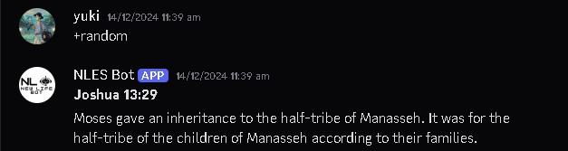

# 📖 AI-Powered Discord Bible Bot

An intelligent, faith-based Discord bot that **only answers Bible-related questions** using AI. Integrated with the [Bible.com API](https://www.bible.com/) to deliver **random Bible verses** and support spiritual growth through conversation.

---

## 🙏 Features

- 🤖 **AI-Powered Q&A**  
  Responds to user questions **only if they are about the Bible**.

- ❌ **Disregards Irrelevant Questions**  
  Politely ignores or rejects non-Bible-related messages to maintain a focused environment.

- 📖 **Random Bible Verse Generator**  
  Fetches and displays random Bible verses using the [Bible.com API](https://www.bible.com/).

- ⚙️ **Easy to Use**  
  Seamless interaction through simple chat messages in Discord.

---

## 📸 Example

```plaintext
User: What does the Bible say about forgiveness?
Bot: "Be kind and compassionate to one another, forgiving each other, just as in Christ God forgave you." — Ephesians 4:32 (NIV)

User: What’s the weather today?
Bot: 🙏 I'm here only to help with Bible questions. Please feel free to ask about scripture.
```
## 📸 Screenshots

### ✅ AI Responds to Bible Questions


### ❌ AI Ignores Non-Bible Questions


### 📖 Random Bible Verses
Here are some examples of the Bible.com verse generator in action:




